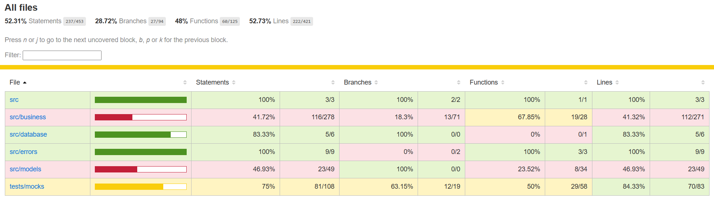

# Labeddit---Back-end

Projeto de back-end com integração com o front-end.
Realizado o desenvolvimento desde o inicio até o deploy, incluindo a documentação do postman.

O deploy do back-end foi feito através da plataforma render.

# Links:

- Deploy Render: *https://https://projeto-labeddit-labenu.onrender.com*
- Labeddit---Front-end: [clique aqui!](https://github.com/Mascariep/Labeddit---Front-end)

# Documentação utilizada:

- Postman: [clique aqui!](https://documenter.getpostman.com/view/24460686/2s93JzKfZR)

# Testes Realizados:

Devido ao tempo, os testes ficaram com uma % baixa, mas será corrigido com o tempo.
